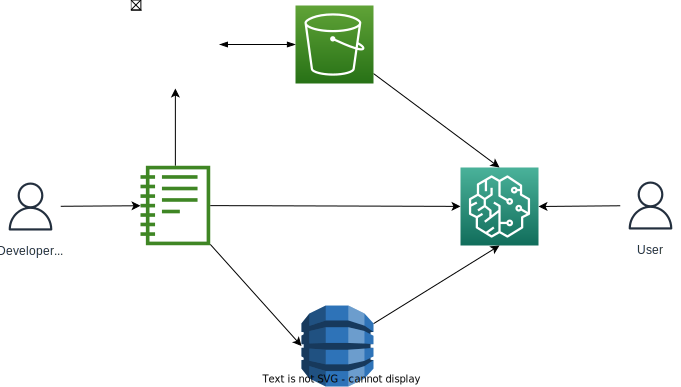

# Description
Integrating the UI as a plugin involves making an extra side menu item for dsp-rule-engine. This could be done in a similar fashion to the existing Redshift plugin or the git plugin. The final result could be similar to the mockup shown below.

The system will rely on the same methods of model deployment as we currently use but can add a few convenience utilities such as automatically creating a folder with the project details and helping the user to link the project with git. It could potentially also facilitate creating the appropriate pull requests to kick off model deployment. A potential architecture of this solution could look as follows:

# User Stories
## The Developers (Advanced)
For advanced rule developers this is likely the most convenient option as they will likely already be working in a sagemaker environment. The advanced rule developer will start their process off loading some data from redshift. Ideally there would be a convenient way to get this data directly into the ui so that as rules are added they can get a visual representation of the counts of data that fall within each segment and potentially add a set of criteria like accuracy with a target and detection rate that they can view. The advanced developer would likely switch back and fourth between this view and a notebook to develop more features or use other tools to discover better decision boundaries.

Once the developer is done with their rules they could press a button that would generate a initial spock workflow from a template and add the config to the flow. They could then import this into their current notebook and run it on live data to generate a report. Some reporting templates can also be incorporated as part of the deploy template to make this process easier.

As part of the template the user should specify a validation dataset and a set of metrics that the model should conform to before it is considered valid. This could be a set of exact requests and responses for specific cases but more generally it could be a target accuracy or alert rate that must be met on a dataset. This way in the future modifications to rules can quickly be validated.

When the developer is happy with the process they could commit the code to a repo and begin the model deployment process. The above validations and metrics will be calculated on deployment and displayed to the user which they can inspect before approving the stage to finally deploy into the respective environments.
## The Developers (Basic)
For developers which are more used to a UI tool this may be a bit inconvenient as they will likely need to get familiar with a new environment (Sagemaker) and they will now need to spin up an instance before they can do any work rather than just going to a page and getting started. Once they have navigated the terrain their process will be quite similar to the advanced developer. They will open the tool and create a project. They will likely not switch too much between notebooks and the app and will likely stay within the confines of safety. 

For the basic developers it will be more essential to attempt to integrate the raw data into the flow creation process so that they can get real-time feedback as the develop rules and in the future entire workflows. These developers will need a way to automatically evaluate if things like features are not available in the source data. For an initial step data can be provided as a csv/parquet source. However in the future with a flow we could introduce a source in the form of either a request or a redshift datasource.

The development of standard and custom metrics will be essential to enable these developers to be data driven rather than basing their decisions on pure intuition. Once these developers have met targets on their metrics they can export their models in an identical fashion to the advanced developers. These developers will likely initially struggle with the concept of a notebook environment to view reporting; However, with targeted templates we could assist them in gathering beneficial metrics to properly validate the rules that they have created. These templates would have to tie in well with the model validation process and potentially prompt the user to define thresholds to evaluate the model on.

The ui can assist these developers greatly in getting git setup and assisting with the deployment process.
## The Maintainers
Maintainers are typically on the same skill-level as the Basic Developers and may even be less of a technical audience attempting to adjust a simple threshold. Due to this they will likely have a hard time opening the environment and cloning a repo to get started. Tight integration between the widget could assist the user as it may be possible to do a discovery process were the user can just select an existing model and it could clone it or open the folder. However this integration would be challenging for open-source as it would be very targeted to how our systems are setup unless a plugin system is used.

Once the maintainer has an existing project cloned they will begin development in a similar fashion to the basic developer. A maintainer will generally stick to making minor adjustments to rules such as changing parameters, thresholds or occasionally adding or deleting a rule. 

The maintainer can rely on the tool to make a commit and push with changes however they would likely battle to make a pr and navigate the model deployment process. A link could be generated to submit the pr and docs could be linked to; however for an executive trying to change a simple threshold this might be quite a cumbersome task.
## The Endpoint Users
Endpoint users will be in tight communication with the developers to understand what input features need to be given into the model. They will at the end of the day be given a url to invoke to integrate with the final model.

If new features are added to the model they will need to ensure that the upstream dependencies are updated in a way that is backwards compatible (always add new features and don't delete old features for a rollover period). That way upstream jobs can be deployed before the rules are changed and ideally a rollover can be smooth. If this is not a possibility they will need to communicate with the Developer that there needs to be a major version change and in this case the new model will be deployed to a new endpoint /v1 vs /v2 and should be deployed before the upstream job. The model can be configured to return a model version so that any downstream logic can handle the results accordingly.
## The Monitors
There will likely be people who are interested in monitoring the real-time performance of the model to determine the accuracy over time. For these cases it will be the responsibility of the developer or endpoint user to integrate the results back into redshift this can be done with the use of endpoint capture or just by storing the results at the end of the day. Ideally results will be enriched at some point with ground-truth values such as if the fraud is confirmed or not. Feature pipelines or prodbooks can be developed to calculate desired metrics and this can be used then in a report on PowerBI for teams to monitor. Setting up the entire monitoring process has quite a few moving parts and may be considered cumbersome.
# Advantages
- A plugin has more control than a widget
- We do not not need to host it (use of existing compute)
# Limitations
- Hard to maintain (Plugin developers are niche)
- Hard to setup (Not much documentation on creating sagemaker plugins is it the same as standard jupyter lab)
- Clients need to login to sagemaker
- Limits possibilities for open-source (niche)
- Hard for managers just wanting to update a parameter