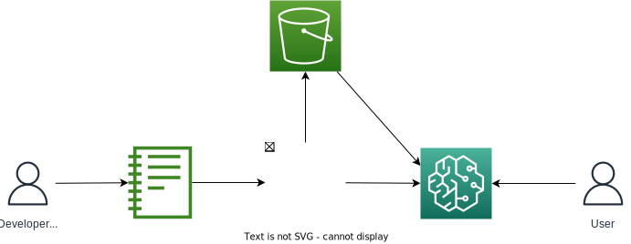

# Description
Exposing the UI as a service means that the app will have its own url and be hosted on odin. It can be possible for clients to spin up their own instances or make use of a shared centralized instance. An example ui could look as follows:

The system could make use of the current approach to deployments. It could also act as a hosting system of its own and create endpoints for flows automatically without the need for additional deployments. This would be advantageous as it opens the possibilities for one click deployments or more advanced AB testing as we can control everything about how the model is rolled out or how it is executed. The architecture could look as follows:

# User Stories
## The Developers (Advanced)
Developers will be able to log in using the portal and navigate to the page. From there they can develop rules in a similar way to what they would as a plugin. To allow them to continue to work in their notebooks it would also be possible to create a widget that can integrate with the server. This will enable the advanced developer to quickly switch between notebook environments and rule development keeping it all in one environment.
## The Developers (Basic)
Developers with less technical backgrounds will find it easier to log into a dedicated app as they do not need to navigate through sagemaker to get into the app. The app and server will always be running so there will be less time required to get up and running. A hosted app will be ideal for basic developers as they will be used to low-code environments where they do not need to look at a single line of code for most usecases. They will log into the app develop a flow and press a button to deploy.
## The Maintainers
The flow of the maintainers will be identical to the developers. However it will be possible to even further simplify the maintenance of executive parameters and thresholds. Essential parameters can be extracted from flows and separated into their own interface. Here it will be possible for maintainers who aren't very technically inclined to update exposed thresholds based on descriptions and test their effects on certain key metrics without ever having to unpack the system as a whole. It will also be possible to create simplified ways to deploy the model using a UI so that maintainers do not need to be familiar with git.
## The Endpoint Users
Endpoint users will be able to use the model in an identical fashion to always. However as a service it may be possible to create a custom serving layer. With a custom serving layer we can handle cases such as automatic rerouting based on input payload capabilities, higher level orchestration (The output of one flow could determine which other flows need to be invoked before a result is returned.), and a prescriptive means for storing and retrieving versioned config.
## The Monitors
A custom service enables us to create a real-time dashboard where we are able to integrate with the serving layer and extract metrics on inputs, outputs or branches taken for each request. We will be able to provide advanced monitoring capacities that will be useful for cases like fraud where we would like to see which rules are affective and which branches are taken in real-time. It would also enable monitors to quickly react if they see that a given rule is producing too few or too many alerts.
# Advantages
- Can use additional protocols (not limited to HTTP requests for inference)
- Easier to integrate with a standardized parameter store if we host the models
# Limitations
- Extra Overheads. Need to worry about:
    - authentication
    - Access control
    - Backups and DR
    - Code execution security (may be possible to extract information about other flows by running your flow and inspecting globals)
    - Processing capacity and autoscaling
- Need to keep at least a pilot server constantly running.