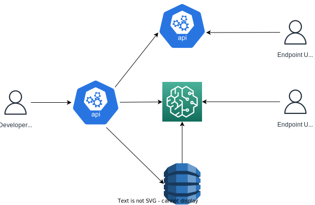

# User Stories
A widget would be similar to a plugin but it would only run inside a running jupyter notebook. So it would have limited functionality and not integrate with the sidebar. An example could look as follows:

The widget would act in a similar fashion to the plugin. There would be minimal differences apart from it would likely be harder to automate some tasks like repo creation. We would likely need to lean more into odin for the creation of repos and would require that developers of rules are more technical.

## The Developers
The user story would be identical to a plugin. A user would likely start their journey in odin to create a new repo. They would then go to github to get the link and then open sagemaker to clone the repo and start development. Once they are done they will push their changes, go back to github to deploy their model and use a tool like postman to test their model before deploying it to various environments.
## The Maintainers
Maintainers would need to be the most technical for this as they would need to be comfortable cloning a repo before making changes to config either using a widget by running in a notebook or by editing it directly in json format. They would then need to know how to push to a branch and go back to github to do the deployment before testing in dev.
# Advantages
- We do not not need to host it (use of existing compute)
- Easier to maintain than a Plugin (less moving parts)
# Limitations
- Hard to maintain (Widget developers are niche)
- Hard to setup (Not much documentation on creating sagemaker plugins is it the same as standard jupyter lab)
- Clients need to login to sagemaker
- Clients need to be familiar with github and jupyter
- Limits possibilities for open-source (niche)
- Hard for managers just wanting to update a parameters